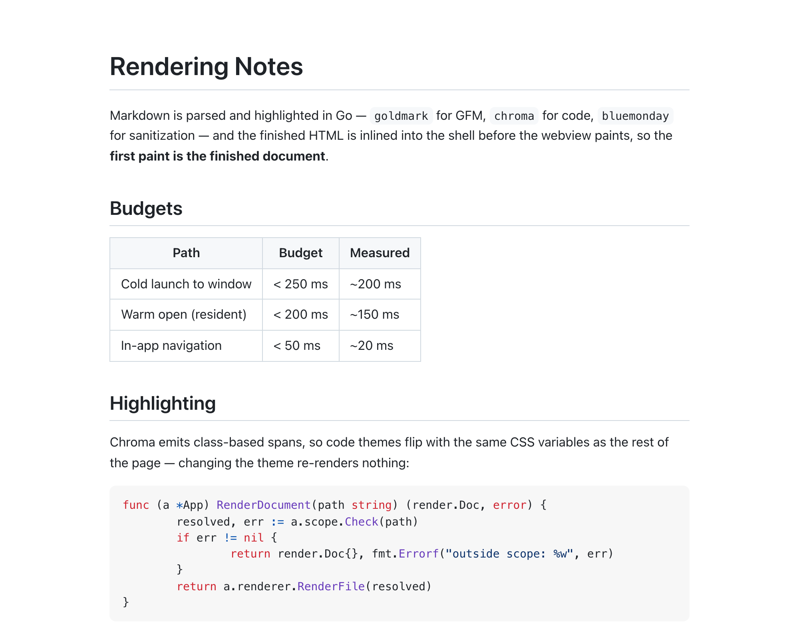
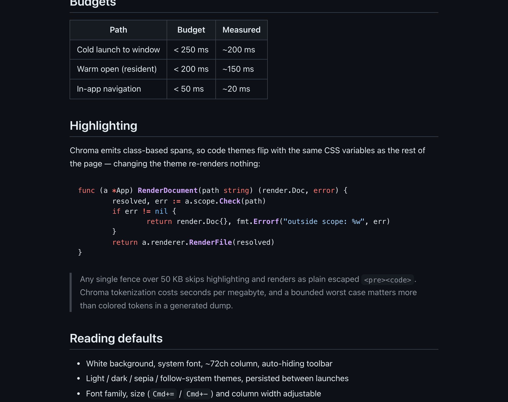
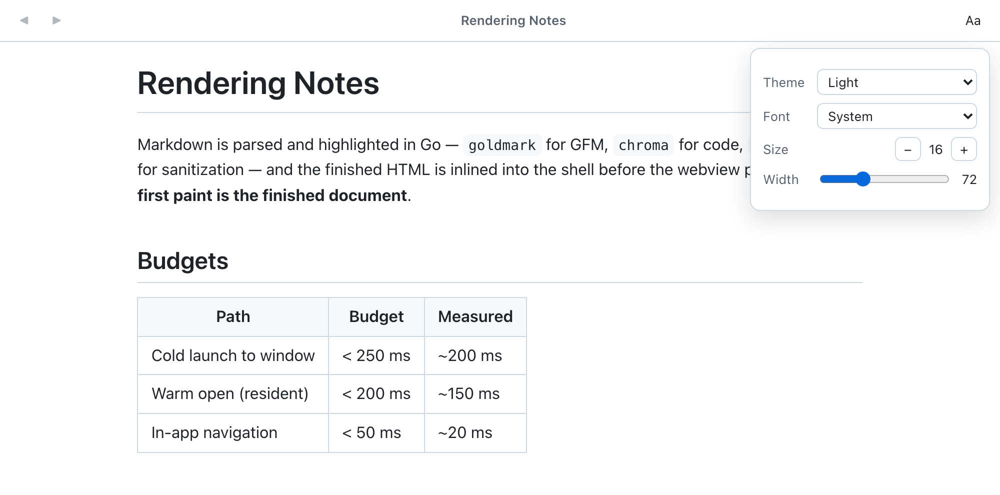

# MDv

[](https://github.com/lifeart/md-view/actions/workflows/ci.yml)

**[mdv site and live demo →](https://lifeart.github.io/md-view/)**

**Double-click a markdown file. Read it. That's the whole product.**

Somewhere in the last few years, markdown stopped being a programmer thing. Meeting notes, specs, AI chat exports, documentation, half the files anyone sends you — it's all `.md` now. And macOS still has no one-click way to *read* one: Quick Look shows raw text, and opening an editor means waiting for an IDE to boot so you can use 5% of it — editing chrome for a reading task.

MDv is the missing viewer: a native macOS app that opens a rendered, readable markdown document faster than you can finish the double-click, and gets out of the way.



*Nothing but the document. The toolbar auto-hides until you reach for it.*

- **Fast, measured:** ~0.4 s from double-click to a rendered window, cold — about 40% of which is AppKit and WebKit starting up before MDv runs a line; ~60 ms into the resident instance. Rendering happens in Go before the webview paints — the first paint *is* the finished document.
- **Everything GitHub renders:** GFM tables (with column alignment), task lists, footnotes, `> [!NOTE]` alerts, `:tada:` emoji, YAML front matter, `<details>`, `<kbd>`, `<picture>`, `$…$` math and ```` ```mermaid ```` diagrams — with GitHub's own heading-anchor slugs, so a table of contents copied from a README still lands where it should.
- **Navigable:** relative links to other markdown files open in-app with back/forward (`Cmd+[` / `Cmd+]`), scroll restoration, and anchor support; `http(s)` links open in your browser.
- **Copy-friendly:** selecting and copying yields plain text; links offer "Copy Link Address"; code blocks have a hover copy button.
- **Readable by default:** white background, system font, ~72ch column, auto-hiding toolbar. Light / dark / sepia / follow-system themes; font family, size (`Cmd+=` / `Cmd+-`), and column width adjustable and persisted.
- **Safe:** all markdown HTML is sanitized; file access is scoped to the directories of documents you open; executables are never handed to the system opener.
- **Small:** Go + Wails v2 + the system WKWebView. ~16 MB binary, no bundled browser, no JS framework. Math and diagrams are the only bundled libraries and they load on demand — a document without them never fetches a byte of either.

See [ARCHITECTURE.md](ARCHITECTURE.md) for the full design — including where a cold launch actually spends its time and why the window presentation is choreographed the way it is.

## Appearance

Theme, font, size and column width live behind the `Aa` button in the auto-hiding toolbar, and persist between launches. Changing one flips CSS variables — nothing re-renders, including the code highlighting.





All three screenshots are the app itself rendering [`docs/screenshots/demo.md`](docs/screenshots/demo.md).

## Install

**[Download the latest DMG](https://github.com/lifeart/md-view/releases/latest/download/MDv.dmg)** — Apple silicon, Developer ID signed and notarized, so it opens without a Gatekeeper prompt. Then:

1. Open the DMG and drag **MDv** into **Applications**.
2. Double-click to launch. A DMG built through `scripts/sign.sh` + `scripts/notarize.sh` (Developer ID + notarized) opens straight away on any Mac; an ad-hoc or development-signed one needs right-click → **Open** once.

The very first launch after installing may be slightly slower while macOS verifies the new binary. After that a cold launch shows the rendered window in ~0.4 s — most of it macOS starting AppKit and WebKit — and every subsequent open goes into the resident instance in ~60 ms. All of these are measured from the Finder gesture by `scripts/perf-coldstart.sh`; see [ARCHITECTURE.md](ARCHITECTURE.md) for the full breakdown.

**MDv stays running after you close its window** (macOS convention — `Cmd+Q` quits). While it is resident, opening a markdown file skips process spawn and WebKit init entirely. To make even the *first* open of a session warm, install the optional login prewarm — it starts MDv hidden when you log in:

```sh
scripts/prewarm.sh install    # scripts/prewarm.sh remove to undo
```

## Preview with the Space bar

MDv installs a Quick Look extension, so selecting a markdown file in Finder and
pressing **Space** shows it rendered rather than as raw text — no app launch at
all. The preview runs MDv's own pipeline (`internal/render`, compiled into the
extension as a C archive), so it cannot disagree with the window you get when
you open the file.

It is a preview, not the app: Quick Look does not execute JavaScript, so math
and Mermaid diagrams appear as their source. Everything else — GFM, alerts,
footnotes, syntax highlighting, images — renders exactly as in MDv.

The extension registers itself when macOS scans the installed app. If Space
still shows plain text, macOS has not picked it up yet; `qlmanage -r` forces a
rescan.

## Make it the default for all markdown files

File associations are registered by the app bundle, but macOS still needs you to pick the *default* handler once. Two ways:

**Finder (no terminal):** right-click any `.md` file → **Get Info** → *Open with:* choose **MDv** → click **Change All…**. Repeat for a `.markdown` file if you use that extension.

**Scripted (all extensions at once):**

```sh
swift scripts/set-default.swift            # uses /Applications/MDv.app
```

The script assigns MDv as default for `.md`, `.markdown`, `.mdown`, and `.mkd` via the same `NSWorkspace` API Finder uses, and prints the before/after handler for each type. (Alternative if you use [duti](https://github.com/moretension/duti): `duti -s com.wails.md-view net.daringfireball.markdown all`.)

To undo, use Finder's **Change All…** to point the types back at another app.

## Development

Requires Go 1.25+, Node 22+, and the Wails v2 CLI (`go install github.com/wailsapp/wails/v2/cmd/wails@latest`).

```sh
wails dev                  # live-reload dev session (also serves the UI to a browser)
go test ./...              # Go tests: render pipeline, links/scope, settings, shell inlining
cd frontend && npx tsc --noEmit   # frontend type check
scripts/e2e-warm-open.sh   # after wails build: drives the real app through close/re-open rounds
                           # and checks (via MDVIEW_TRACE) that the document just opened is the
                           # one committed — the OS un-hide vs. doc:open race has no unit-test seam
scripts/e2e-frontend.sh    # after a frontend build: runs the built dist headless with the Wails
                           # bindings stubbed, and checks that math, diagrams, copy buttons and
                           # anchors come out right on *both* entry paths (cold-launch inline and
                           # doc:open) — none of which the Go tests can see
scripts/perf-coldstart.sh  # after wails build: launch breakdown, timed from the Finder gesture
                           # (not from the app's first trace line, which flatters it by a third)
scripts/build-quicklook.sh # after wails build: builds the Quick Look extension and embeds it in
                           # the bundle (wails build knows nothing about app extensions). Run
                           # scripts/sign.sh after it — nested code signs before its container.
```

The Quick Look extension only loads from an app macOS has registered, so it
cannot be tested from `build/bin`: install the bundle to `/Applications` first.
It logs what it rendered, which is the only way to see inside a sandboxed
extension — `/usr/bin/log stream --level debug --predicate '"'"'subsystem == "com.wails.md-view"'"'"'`
(the full path matters: `log` is also a zsh builtin).

Note: file associations only work for the built, installed bundle — under `wails dev`, open files via `Cmd+O`, drag-and-drop, or a CLI argument (`wails dev -appargs /path/to/doc.md`). Quit any installed MDv before starting a dev session: the single-instance lock makes the second launch hand its arguments to the resident instance and exit, which ends `wails dev` immediately.

## Build & package

```sh
wails build                # production bundle at build/bin/md-view.app
scripts/sign.sh            # re-sign with a stable identity (Developer ID if you have one)
scripts/notarize.sh        # Developer ID only: notarize + staple, for other Macs
```

Note that `wails dev` overwrites `build/bin/md-view.app` with a development
build — run it *before* signing, never between signing and notarizing, or the
ticket Apple issues will not match the bundle on disk.

`wails build` ad-hoc-signs the bundle, which produces a different identity every build — macOS then treats each build as a new app and resets its TCC permissions. `scripts/sign.sh` re-signs for a stable identity: it picks a **Developer ID Application** certificate when the keychain has one, otherwise an **Apple Development** one, and always signs with the hardened runtime and a secure timestamp (both prerequisites for notarization).

**To run on other Macs, signing is only half of it.** A Developer ID signature with no notarization is still assessed as `source=Unnotarized Developer ID` and blocked — `scripts/notarize.sh` submits the bundle (or a DMG) to Apple's notary service, waits for the answer, staples the ticket so it also validates offline, and prints the Gatekeeper assessment. It takes credentials one of two ways:

```sh
# App Store Connect API key (also what CI uses; nothing account-password-shaped)
NOTARY_KEY=~/.apple-signing/AuthKey_XXXXXXXXXX.p8 \
NOTARY_KEY_ID=XXXXXXXXXX NOTARY_ISSUER=<issuer-uuid> scripts/notarize.sh

# or an Apple ID + app-specific password, stored once in the keychain
xcrun notarytool store-credentials mdv     # interactive, asks for both
NOTARY_PROFILE=mdv scripts/notarize.sh
```

Keep the `.p8`, the certificate's private key and its `.p12` export outside the repository (`~/.apple-signing/`, mode 600) — the API key is downloadable exactly once, and a lost certificate key means issuing a new certificate.

DMG (compressed, with an Applications shortcut; the bundle is staged as `MDv.app` so the Finder label matches the product name):

```sh
STAGE=$(mktemp -d) && cp -R build/bin/md-view.app "$STAGE/MDv.app" && ln -s /Applications "$STAGE/Applications"
hdiutil create -volname "MDv" -srcfolder "$STAGE" -ov -format UDZO build/bin/md-view-0.1.0.dmg
```

## CI

Two GitHub Actions workflows live in `.github/workflows/`; the badge at the
top of this file tracks `ci.yml`.

**`ci.yml`** — on every push to `main` and every pull request. Superseded runs
are cancelled. Three jobs:

| Job | Runner | What it does |
|---|---|---|
| macOS | `macos-15` | `npm ci` → `go vet` → `npx tsc --noEmit` → `go test` → `wails build` → `go test` again → generated-file sync checks → uploads the `.app` (ditto archive) as a build artifact |
| Linux | `ubuntu-24.04` | Installs `libgtk-3-dev` + `libwebkit2gtk-4.1-dev`, then `go vet`/`go build`/`go test ./internal/...` with `-tags webkit2_41` |
| Windows | `windows-latest` | `go vet`, `go build`, `wails build` (WebView2 needs no system packages) |

Two details worth knowing:

- **The test suite runs twice on macOS, before and after `wails build`.** The
  post-build run is the stronger one: `TestServeShellAgainstBuiltDist` skips
  when `frontend/dist` is empty (fresh clone) and only exercises the real
  built shell once the frontend has been compiled.
- **Two generated files are committed and verified in sync.**
  `frontend/src/chroma.css` is regenerated with `go run ./tools/gen-chroma`,
  and `frontend/wailsjs/` is regenerated by `wails build`; both are then
  checked with `git diff --exit-code`, so a stale commit fails CI.
- **`frontend:install` in `wails.json` is `npm ci`, not `npm install`.** That
  check compares the whole tree, and `npm install` rewrites
  `package-lock.json` to whatever the local npm major prefers (npm 11 writes
  `libc` fields that npm 10 strips), which fails the build on a version
  difference alone. `npm ci` never writes the lockfile.

Linux and Windows are compile-and-cross-check jobs so the non-macOS build
paths cannot rot. They deliberately skip the root-package tests, which assert
macOS behaviour (`open` / `open -R` from `OpenWithSystemDefault`); Windows
also skips `internal/...`, whose table tests use POSIX absolute paths.

**`release.yml`** — on a `v*` tag. Builds on macOS, packages
`build/bin/md-view-<version>.dmg` (app + `/Applications` symlink, UDZO), and
creates the GitHub release with the DMG attached.

**Signing turns itself on.** There is no switch to flip: a first step checks
whether the repository has the Apple secrets and sets an output the signing
steps key off. Add these under *Settings → Secrets and variables → Actions*
and the next tag produces a Developer ID-signed, notarized DMG whose release
notes say so; leave them out and the same tag produces an ad-hoc signed one
(right-click → **Open** on first launch) plus a `::warning::` naming the
secrets that were missing — never a failed release.

| Secret | What it is |
|---|---|
| `MACOS_CERTIFICATE` | base64 of a "Developer ID Application" `.p12` export (`base64 -i cert.p12 \| pbcopy`) |
| `MACOS_CERTIFICATE_PWD` | password for that `.p12` |
| `MACOS_SIGNING_IDENTITY` | optional — `scripts/sign.sh` finds the imported certificate on its own |
| `NOTARY_KEY_P8` | contents of the App Store Connect API key `.p8` |
| `NOTARY_KEY_ID` | that key's Key ID |
| `NOTARY_ISSUER` | the Issuer ID shown above the key list |

The signing and notarization steps call the same `scripts/sign.sh` and
`scripts/notarize.sh` used locally, so CI and a hand-made release cannot
drift apart.
