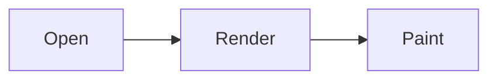

# GitHub Flavored Markdown

Everything github.com renders in a `.md` file, in one document.

## Alerts

> [!NOTE]
> Useful information a user should know.

> [!TIP]
> Helpful advice.

> [!IMPORTANT]
> Key information users need.

> [!WARNING]
> Urgent info needing immediate attention.

> [!CAUTION]
> Advises about risks.

> A plain blockquote, which must stay plain.

## Footnotes

Rendering happens in Go[^go], before the webview paints[^paint].

[^go]: goldmark, chroma and bluemonday.
[^paint]: See **ARCHITECTURE.md** for the measurements.

## Math

Mass-energy equivalence is $E = mc^2$, and inline TeX may hold dollars via $`\$5`$.

$$
\frac{n!}{k!(n-k)!} = \binom{n}{k}
$$

```math
\int_0^\infty e^{-x^2}\,dx = \frac{\sqrt{\pi}}{2}
```

Prose with prices must not become math: it cost $5 and then $10.

## Code

```go
func main() { fmt.Println("hello") }
```

## Diagrams



## Emoji

Shipped :rocket: — reviewed :+1: — celebrated :tada:

## Tables

| Left | Center | Right |
| :--- | :----: | ----: |
| `code` | **bold** | [link](https://example.com) |
| a \| b | ~~gone~~ | 42 |

## Task lists

- [x] Parse GFM
  - [ ] Nested item
- [ ] Ship

## Ordered list starting elsewhere

5. five
6. six

## Autolinks

https://example.com, www.example.com and someone@example.com.

## Inline HTML

Press <kbd>Cmd</kbd><kbd>K</kbd>. Water is H<sub>2</sub>O, and x<sup>2</sup> grows.
<ins>Inserted</ins>, <mark>highlighted</mark>, <del>deleted</del>.

<details>
<summary>A collapsed section</summary>

Hidden **content**, revealed on click.

</details>

<div align="center">

Centered by the README idiom.

</div>

<picture>
  <source srcset="pixel.png" media="(prefers-color-scheme: dark)">
  
</picture>

<a name="legacy-anchor"></a>

Older READMEs mark targets with `<a name>`; [this link](#legacy-anchor) needs it.

## Ünïcödé — 見出し

GitHub keeps non-ASCII letters in anchors: [jump](#ünïcödé--見出し).

## Duplicate

## Duplicate

Two headings, two ids: [first](#duplicate), [second](#duplicate-1).

## Line breaks

Backslash break\
lands here.

Two-space break  
lands here too.
